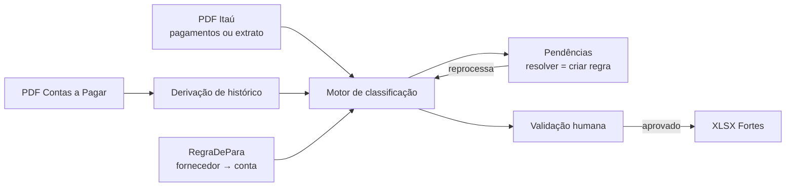

# Extrato → De/Para → FortesERP

Webapp que transforma os relatórios de pagamento do Itaú em arquivo de importação para o
**FortesERP**, classificando cada pagamento em conta contábil por regra **De/Para** de fornecedor,
derivando o histórico do relatório de Contas a Pagar, e travando a exportação atrás de aprovação
humana.

Medido sobre junho de 2026, com os arquivos reais do cliente: **439 lançamentos, 77% classificados
automaticamente, 101 linhas pendentes agrupadas em 19 decisões de fornecedor.**

## Como rodar

```bash
# backend
cd backend
python3 -m venv .venv && .venv/bin/pip install -r requirements.txt
.venv/bin/python -m uvicorn app.api:app --reload

# frontend, em outro terminal
cd frontend
npm install
npm run dev            # http://localhost:5173
```

O primeiro start semeia o SQLite com o plano de contas, a Base Bancos e a base De/Para minerada
(174 fornecedores, 203 regras, 161 ativas). Depois: no Início, Conciliar abre o calendário do
mês; Histórico lista os lotes. Subir os PDFs do lote ativo, resolver pendências, aprovar, exportar.

Quem for apresentar o sistema noutro computador: [`docs/handover/APRESENTACAO.md`](docs/handover/APRESENTACAO.md).
Copia `.env.example` para `backend/.env` e deixa `AUTH_MODO=desligado` — assim não pede Google.

Login (Google / Outlook) fica desligado até existirem client id/secret no ambiente. Copie
[`.env.example`](.env.example) para `backend/.env`, preencha os clientes OAuth e use
`AUTH_MODO=ligado` em produção. Redirects locais:

- `http://localhost:5173/api/auth/callback/google`
- `http://localhost:5173/api/auth/callback/microsoft`

Hospedagem prevista: **https://conciliador.projecont.com.br**

```bash
cd backend && .venv/bin/python -m pytest -q     # 89 testes, ~45s
```

A suíte roda contra os arquivos reais em `arquivos-clickip/` — não há fixture sintética
([ADR 0009](docs/adr/0009-estrategia-de-testes-e-golden-files.md)).

## O fluxo



São **dois insumos, não um**: o relatório Itaú define quais linhas existem; o Contas a Pagar fornece
o histórico. Sem o segundo, nenhum histórico é derivado.

## Estado do projeto

Sete fases de motor, grade e casca concluídas. Comece por [`docs/handover/`](docs/handover) — cada arquivo diz o que foi decidido, quais são as armadilhas e como verificar por conta própria em vez de confiar no relato.

| Fase | Entrega | Handover |
|---|---|---|
| 0 | Análise dos arquivos reais, mineração da base De/Para | [FASE-0](docs/handover/FASE-0.md) |
| 1 | Requisitos, política de histórico e SISPAG | [FASE-1](docs/handover/FASE-1.md) |
| 2 | Spike de extração por coordenada, modelo de dados, design system | [FASE-2](docs/handover/FASE-2.md) |
| 3 | Parsers, motor, API, interface | [FASE-3](docs/handover/FASE-3.md) |
| 4 | Testes e limiares medidos | [FASE-4](docs/handover/FASE-4.md) |
| 5 | Export travado por aprovação | [FASE-5](docs/handover/FASE-5.md) |
| 6 | Grade Fortes + exceção por linha | [FASE-6](docs/handover/FASE-6.md) |
| 7 | Design, usabilidade e administração de competências | [FASE-7](docs/handover/FASE-7.md) |

### Decisões de arquitetura

| ADR | Assunto |
|---|---|
| [0001](docs/adr/0001-arquitetura-stack.md) | React/Vite + FastAPI + SQLite |
| [0002](docs/adr/0002-chave-casamento-cnpj.md) | Casamento por documento + nome, não por substring |
| [0003](docs/adr/0003-constituicao-base-depara.md) | Base De/Para minerada do histórico, com score |
| [0004](docs/adr/0004-reaproveitamento-rayo.md) | Do Rayo vêm padrões, não código |
| [0005](docs/adr/0005-politica-historico-sispag.md) | Enriquecer o histórico genérico `SISPAG` |
| [0006](docs/adr/0006-modelo-dados-e-normalizacao-contas.md) | Modelo de dados e dígito verificador |
| [0007](docs/adr/0007-estrategia-extracao-pdf.md) | Extração de PDF por coordenada |
| [0008](docs/adr/0008-design-system-e-tokens.md) | Tokens semânticos e modo Operate |
| [0009](docs/adr/0009-estrategia-de-testes-e-golden-files.md) | Golden file de junho e limiares medidos |
| [0010](docs/adr/0010-layout-export-fortes.md) | Layout do export derivado empiricamente |
| [0011](docs/adr/0011-grade-fortes-na-validacao.md) | Validar é a planilha Fortes; edição de linha não cria regra |
| [0012](docs/adr/0012-administracao-de-competencias.md) | Área para administrar competências (listar, abrir, trocar lote) |
| [0013](docs/adr/0013-fonte-visual-design-reference.md) | Fase 7 lê `design-reference/` por inteiro; não busca visual fora |
| [0015](docs/adr/0015-casca-vidro-wizard-e-calendario.md) | Trilho de sistema + wizard; vidro no cromo; calendário ao conciliar (sucessor do 0013 no material) |
| [0016](docs/adr/0016-porta-oauth-google-microsoft.md) | Porta OAuth Google/Microsoft no FastAPI; cookie HttpOnly |

## Estrutura

```
extrato-de-para-fortes/
├── backend/
│   ├── app/
│   │   ├── api.py               # rotas FastAPI (inclui GET/POST /api/regras)
│   │   ├── modelos.py           # SQLModel: 9 entidades
│   │   ├── normalizacao.py      # conta, documento, nome, moeda
│   │   ├── parsers/             # plano de contas, Itaú (2 layouts), Contas a Pagar
│   │   ├── motor/               # classificador, histórico, validador, processador
│   │   └── export_fortes.py     # XLSX final + planilha de conferência
│   └── tests/                   # 80 testes sobre os arquivos reais
├── frontend/src/
│   ├── estilos/tokens.css       # tokens do kit ClickIP; única fonte de cor
│   ├── componentes/
│   └── telas/                   # início, histórico, regras + wizard da jornada
├── tools/
│   ├── minerar_depara.py        # gera a base De/Para inicial (offline)
│   └── spike_contas_pagar.py    # prova de extração por coordenada
├── docs/
│   ├── adr/                     # 15 decisões
│   ├── handover/                # 8 fases (0–7)
│   ├── requisitos/
│   ├── telas/                   # capturas das 5 superfícies, claro e escuro
│   └── base-depara-inicial.xlsx # para revisão do contador
├── arquivos-clickip/            # arquivos do cliente (entrada dos testes)
├── design-reference/
├── specs/                       # VAZIA — ver aviso abaixo
└── reference/                   # código do Rayo, só estudo
```

## Aviso sobre `specs/`

Versões anteriores deste README afirmavam que `specs/RCO010_ImportarLote.pdf` contém a especificação
de importação do Fortes. **O arquivo não existe e a pasta está vazia.** A especificação nunca foi
entregue.

O layout do export foi derivado dos seis arquivos que o contador já entregou ao Fortes — 2.487 linhas
de janeiro a junho de 2026 — e está documentado em
[ADR 0010](docs/adr/0010-layout-export-fortes.md). São 10 colunas, e três delas (`H`, `I`, `J`) são
constantes cuja semântica **continua desconhecida**. Se o RCO010 aparecer, ele confirma o layout ou
gera um ADR sucessor.

## O que ficou fora do MVP

- Netting e matching Doc↔Origem de `reference/banco-razao`: outro caso de uso, e
  [`docs/01-analise-rayo-referencia.md`](docs/01-analise-rayo-referencia.md) registra que depende de
  campos que nenhum parser preenche.
- Chave composta para os 13 fornecedores multi-conta (RF-02.12): hipótese não validada; hoje eles
  caem em pendência.
- Outras contas correntes além da conta Itaú do histórico. O modelo já é lookup, mas nunca foi
  exercitado com uma segunda conta.

## Origem

Iniciado a partir de `docs/00-plano-engenharia.md` e de trechos do monorepo **Rayo**, copiado
seletivamente de `/Users/ryanrichard/projecont/Rayo` em 2026-08-24. Arquivos em `reference/` são
cópias de estudo, com imports quebrados de propósito.

O plano original previa Flask, entrada única e casamento por substring. Os três pontos foram
revistos contra os dados reais nas fases 0 a 2; a divergência está registrada em
[`docs/02-analise-arquivos-cliente.md`](docs/02-analise-arquivos-cliente.md) e nos ADRs 0001 e 0002.
