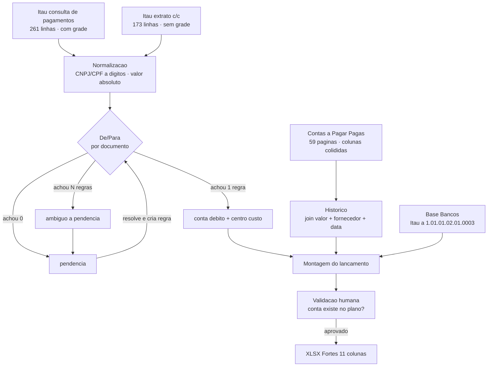

# Análise dos arquivos reais do cliente (ClickIP)

> Fase 0 · 2026-08-24 · fonte: [`arquivos-clickip/clickIP/`](../arquivos-clickip/clickIP)
> Todos os números deste documento foram medidos nos arquivos, não estimados.

## 0. Por que este documento existe

[`00-plano-engenharia.md`](00-plano-engenharia.md) foi escrito antes de os arquivos do cliente
serem inspecionados. Três de suas premissas não se sustentam contra os dados reais. Este
documento registra a evidência para que nenhum agente futuro reimplemente o desenho errado.

| Premissa do plano | O que os arquivos mostram |
|---|---|
| Um insumo (o extrato) | **Três** insumos: dois relatórios Itaú de layouts diferentes + o Contas a Pagar do Fortes |
| Chave = `termo ∈ descrição` | Chave = **CNPJ/CPF do favorecido**; a descrição bancária é ruído |
| Layout de export vem do `RCO010_ImportarLote.pdf` | O PDF **não existe** (`specs/` está vazia); o layout foi derivado dos 6 XLSX entregues |

## 1. Inventário

| Arquivo | Tipo | Tamanho útil |
|---|---|---|
| `Relatorio ITAU CLICK-SCM - 01 A 20-06-2026.pdf` | Consulta de pagamentos | 8 pág · 261 linhas · 01/06–19/06 |
| `Relatorio ITAU CLICK-SCM - 21 A 30-06-2026.pdf` | **Extrato de conta corrente** | 5 pág · 173 linhas · 22/06–30/06 |
| `Contas a Pagar - Pagas ... 01-01 a 30-06-2026.pdf` | Fortes AG Financeiro 5.65.1 | 59 pág · 63 despesas distintas |
| `PLANO DE CONTAS CLICK SCM 2026.xlsx` | Plano de contas | 1.864 linhas · 1.516 analíticas |
| `CLICK SCM {01..06}2026*.xlsx` | Saída Fortes já pronta | 7 arquivos · 2.893 linhas |

### 1.1 Duplicata confirmada

`CLICK SCM 042026 - ITAU.xlsx` e `CLICK SCM 042026 - ITAU (1).xlsx` são **byte-idênticos**
(MD5 `9ea11d8613acad66…`). São 6 meses de histórico, não 7. Linhas únicas: **2.487**.

## 2. Os dois relatórios Itaú são relatórios diferentes

Esta é a descoberta com maior impacto no parser. Os nomes dos arquivos sugerem duas metades do
mesmo relatório; são dois produtos distintos do internet banking.

### 2.1 `01 A 20` — consulta de pagamentos, transferências e Pix

Sete colunas nomeadas, com linhas de grade no PDF, então `pdfplumber.extract_tables()` funciona
direto:

```
favorecido/beneficiário | CPF/CNPJ | tipo de pagamento | referência da empresa
                        | data do pagamento | valor (R$) | status
```

Tipos de pagamento medidos: `Boleto outros bancos` 100, `Boleto Itaú` 58,
`PIX Transferências` 48, `Conta Corrente` 30, `Concessionária` 16, `PIX Qr Code` 5,
`Tributos com código de barras` 2, `DARF código de barras` 1, `Concessionária com moeda variável` 1.

20 das 261 linhas vêm **sem CPF/CNPJ** (concessionárias como `MANAUS AMBIENTAL-AGUAS MANAUS`).

### 2.2 `21 A 30` — extrato de conta corrente

Seis colunas, **sem linhas de grade**. `extract_tables()` retorna zero tabelas; exige extração por
coordenada.

```
Data | Lançamentos | Razão Social | CNPJ/CPF | Valor (R$) | Saldo (R$)
```

Diferenças que o parser precisa absorver:

- Valores **negativos** (`-85.000,00`), não positivos.
- Traz `Saldo total R$ 277.690,66` no cabeçalho — útil como validação de fechamento.
- Descrição bancária livre na coluna `Lançamentos`: `BOLETO PAGO` 114, `PIX ENVIADO` 31,
  `PAGAMENTOS TRANSF` 14, `PAGAMENTOS CONCESSIONARIA` 10, `PAGAMENTOS TRIB` 3.
- **Inclui CPF de pessoa física** (4 das 173 linhas): `767.696.822-49`, `021.023.542-02`.
  A chave de casamento precisa aceitar 11 e 14 dígitos.
- A `Razão Social` quebra em múltiplas linhas no PDF
  (`ASSOCIACAO BRASILEIRA DE` / `RECURSOS EM TELECOMUNICAC`).

### 2.3 Cobertura de junho

261 + 173 = **434 linhas** contra 439 no XLSX de junho. Dias 20 e 21/06/2026 caem em
sábado e domingo, então a lacuna entre os dois relatórios não perde movimento. A diferença de 5
linhas fica em aberto para a Fase 3 — hipóteses: nomes multi-linha que a extração ainda perde, ou
lançamentos que o contador acrescentou à mão.

## 3. Layout de destino (export Fortes)

Derivado dos 6 XLSX. Onze colunas, sem cabeçalho semântico — a linha 1 já contém dados de
posicionamento (`0001`, `001`).

| Col | Conteúdo | Constante? | Origem |
|---|---|---|---|
| A | Filial | sim `0001` | Matriz |
| B | Data | não | data do pagamento |
| C | **Débito** | não | **De/Para por favorecido** |
| D | Crédito | sim `1.01.01.02.01.0003` | conta do banco |
| E | Valor | não | valor pago (positivo) |
| F | Histórico | não | derivado do Contas a Pagar |
| G | **Centro de custo** | não | De/Para por favorecido |
| H | — | sim `001` | — |
| I | — | sim `0001` | — |
| J | — | sim `001` | — |
| K | favorecido/beneficiário | — | coluna de trabalho, **só existe em junho** |

Coluna D confirmada contra o plano de contas: `1.01.01.02.01.0003-4` = `Banco Itaú Ag: 1557 Cc: 98810-0`,
que é exatamente a conta do cabeçalho dos dois relatórios Itaú (`agência 1557 conta 00988100`).

A semântica de H, I e J não foi determinada — são invariantes em todas as 2.487 linhas. Tratar
como constantes de layout e confirmar com o cliente antes de assumir significado.

### 3.1 Base Bancos

O plano de contas tem 5 contas correntes. A "Base Bancos" do fluxograma é esta tabela:

| Conta contábil | Banco |
|---|---|
| `1.01.01.02.01.0001-8` | Bradesco Ag 2396 Cc 0037924-7 |
| `1.01.01.02.01.0002-6` | Cresol Ag 2682 Cc 040999-5 |
| `1.01.01.02.01.0003-4` | **Itaú Ag 1557 Cc 98810-0** ← único em uso |
| `1.01.01.02.01.0004-2` | Banco do Brasil Ag 5927 Cc 8788 |
| `1.01.01.02.01.0005-0` | Sicoob Ag 5024 Cc 132816-6 |

### 3.2 Dígito verificador — armadilha de 100%

O plano de contas grafa os códigos **com** dígito verificador (`1.01.01.02.01.0003-4`); o arquivo
Fortes grafa **sem** (`1.01.01.02.01.0003`). 1.519 das 1.864 linhas do plano têm o sufixo. Sem
normalizar, validar uma conta do export contra o plano falha em **todos** os casos.

## 4. Centro de custo (coluna G)

Não é constante e não vem de nenhum dos relatórios Itaú. Distribuição em junho:

| Centro | Linhas |
|---|---|
| `0001` | 373 (85%) |
| `0005` | 26 |
| `0007` | 13 |
| `0004` | 8 |
| `0006` | 8 |
| `0009` | 5 |
| `0010` | 3 |
| `0011` | 3 |

O fluxograma o coloca como atributo da regra De/Para
(`Conta Debito · Descricao · Fornecedor · Centro Custo`), mas **os dados contradizem isso
parcialmente**: 16 fornecedores aparecem com mais de um centro de custo mantendo a mesma conta de
débito. `ORSEGUPS` usa 6 centros; `TERACOM TELEMATICA` usa 5.

Testamos se a coluna `referência da empresa` do relatório Itaú explicaria o centro. **Não
explica**: das 284 linhas de junho que casaram entre relatório e planilha, 164 têm essa referência
vazia, e o resto traz número de documento (`NF 188357`, `NFS 95`) ou nome de praça (`CAMPINAS`,
`OSASCO`), sem correspondência estável.

Consequência de modelagem: a regra De/Para **fixa a conta de débito**; o centro de custo é
**sugestão** (o dominante do fornecedor) ajustável por lançamento na tela de validação. Tratá-lo
como determinístico produziria erro silencioso nesses 16 fornecedores.

## 5. A base De/Para não foi entregue

Nenhum arquivo é a "Base De x Para" do fluxograma. Isso é coerente com a primeira linha do plano
("vamos precisar montar a base do de para antes de iniciar"), mas ela **é recuperável** do
histórico: 2.487 lançamentos já classificados por um contador ao longo de 6 meses.

Junho é o mês privilegiado — a coluna K dá `favorecido → conta débito + centro de custo` sem
inferência: 187 nomes crus, que após normalizar sufixo societário e truncamento são
**174 fornecedores reais**.

A mineração está feita: [`base-depara-inicial.md`](base-depara-inicial.md) tem o resultado
completo. 161 dos 174 (93%) saem com regra pronta.

### 5.1 O De/Para não é 1:1

**13 fornecedores apontam para mais de uma conta de débito.** Os maiores:

| Favorecido | Contas | Natureza |
|---|---|---|
| `BRADESCO ADMINISTRADORA DE CON` | 10 (`1.07.04.01.03.0022`…`0031`) | uma conta por cota de consórcio |
| `LIVETECH DA BAHIA INDUSTRIA E COMERCIO S` | 7 | parcelamento + imobilizado + estoque |
| `AMBAR ENERGIA AMAZONAS S.A.` | 3 | consumo vs uso de poste |
| `CLARO S.A` · `EMBRACON` | 3 cada | — |
| `TIM`, `EMBRATEL`, `PADTEC`, `ENERGISA`, `EQUATORIAL`, `LEBLON`, `C F BORGES`, `ABRT` | 2 cada | — |

Não é erro de digitação: os consórcios Bradesco e Embracon usam **uma conta por cota**, e
distribuidoras de energia separam consumo de uso de poste. A ambiguidade é do domínio contábil e
precisa de desambiguação explícita, não de "escolher a mais frequente".

### 5.2 Nomes são chave ruim, CNPJ é chave boa

Os nomes chegam truncados em 30 caracteres na coluna K (`EQUINIX DO BRASIL SOLUCOES DE`) e em
variantes entre as fontes:

- `EQUATORIAL PARA DISTRIBUIDORA` vs `EQUATORIAL PARA DISTRIBUIDORA DE ENERGIA S.A.`
- `LIVETECH DA BAHIA INDUSTRIA E` vs `LIVETECH DA BAHIA INDUSTRIA E COMERCIO S`

Sem colapsar essas variantes, o mesmo fornecedor é contado duas vezes e aparece como "ambíguo".

Pior, `includes()` sobre nome produz falso positivo real neste cliente:

| Documento | Favorecido | Conta |
|---|---|---|
| `19402859000155` | `CLICK IP I MAIS` | `1.01.01.02.01.0004` |
| `13169745000120` | `CLICK IP LOCACAO DE EQUIPAMENTOS LTD` | `1.01.05.01.02.0009` |
| `13184931000139` | `CLICK IP PROVEDORES DE ACESSO LTDA` | `1.01.05.01.02.0007` |
| `19402859000155` | `CLICK IP SERVICOS DE COMUNICAC` | `1.01.05.01.01.0001` |
| `39809271000128` | `CLICK IP TECNOLOGIA LTDA` | `1.01.05.01.02.0008` |

Cinco entidades do grupo, prefixo `CLICK IP` comum, cinco contas distintas. É exatamente o teste
de falso positivo que a seção 4 do plano manda fazer — e a abordagem por substring falha nele.

Ambos os relatórios Itaú trazem CPF/CNPJ canônico. **A chave é o documento normalizado a dígitos.**

### 5.3 Mas o documento também não basta sozinho

Note as linhas 1 e 4 da tabela acima: o mesmo CNPJ `19.402.859/0001-55` — que é o **da própria
empresa**, conforme o cabeçalho dos relatórios Itaú — aparece com duas contas, uma de
transferência entre contas próprias (`1.01.01.02.01.0004` = Banco do Brasil) e uma intercompany.
São 4 documentos nessa situação.

A chave precisa ser **documento + nome**, com o nome desempatando. Ver
[`adr/0002-chave-casamento-cnpj.md`](adr/0002-chave-casamento-cnpj.md).

## 6. Histórico: `SISPAG FORNECEDORES` não é fallback, é dívida manual

A coluna F alterna entre histórico rico (`Débito Banc. ref. NFS-e 889048 - Orsegups Monitoramento`)
e o genérico `SISPAG FORNECEDORES`. A taxa oscila de forma que descarta explicação técnica:

| Mês | Linhas | `SISPAG` | % |
|---|---|---|---|
| 01/2026 | 407 | 44 | 10% |
| 02/2026 | 414 | 15 | 3% |
| 03/2026 | 457 | 11 | 2% |
| 04/2026 | 406 | 132 | 32% |
| 05/2026 | 364 | 116 | 31% |
| 06/2026 | 439 | 91 | 20% |

Se fosse ausência de dado, a taxa seria estável. Variar de 2% a 32% indica esforço manual variável.

Medição que confirma: das 91 linhas `SISPAG` de junho, **85% têm o valor presente no Contas a
Pagar** — contra 81% das linhas enriquecidas. O dado estava disponível e não foi usado.

`SISPAG` é o sistema de pagamento em lote do Itaú. No **extrato**, o banco escreve apenas
"SISPAG FORNECEDORES" e o favorecido fica invisível. Trabalhando do extrato, o contador não tinha
como identificar o fornecedor. O relatório de consulta de pagamentos, que agora temos, **identifica**.

### Consequência para os testes

`CLICK SCM 062026.xlsx` é gabarito confiável para Débito, Crédito, Valor, Data e Centro de custo.
**Não é gabarito para Histórico.** O teste ponta a ponta compara as 348 linhas de histórico
derivado; nas 91 `SISPAG` a divergência é a melhoria esperada do produto, e o teste deve registrá-la
como tal em vez de reproduzir a limitação.

## 7. Contas a Pagar: a fonte do Histórico

59 páginas, agrupadas por despesa (`Despesa: 301010 - D IMOB - Benfeitorias Imóveis Próprios`),
63 despesas distintas. Colunas:

```
Fornecedor | Conta a Pag. | Venc. | Tipo Doc. | Título | Doc. Entrada
           | Valor Título | Valor Pago | Desc. | Juros | Total Pago
```

O `Tipo Doc.` + `Título` são o que compõe o histórico
(`NFS-E` + `889048` → `Débito Banc. ref. NFS-e 889048 - Orsegups Monitoramento`).

### 7.1 Maior risco técnico do projeto

`extract_text()` devolve colunas colididas. Exemplo real da página 1:

```
DEYWISON BRUNO PEDROZA SILV2A0 7296305300403978238731/03/2026 NFS-E 41 27/03/2026 350,00
JS ENTULHO COLETA DE RESIDUO2S0 2P6E0R6I0G0O71S0OS 2E2 N/0A6O/2 0P2E6RIGOSOS EIRNEFLSI-E 1240
```

O nome do fornecedor transborda sua coluna e se entrelaça caractere a caractere com
`Conta a Pag.` e `Venc.`. Extração linear é inviável; exige `extract_words()` com fronteiras de
coluna lidas do cabeçalho e reconstrução por posição x. Em 59 páginas.

Isto é um **spike obrigatório da Fase 2**: a Fase 3 não começa sem ele resolvido, porque sem o
Contas a Pagar não há coluna Histórico e o produto entrega 100% de `SISPAG`.

### 7.2 O código de despesa como desambiguador

Os 63 códigos de despesa (`301010`, `202053`, `207009`) não são o código contábil nem o
"Reduzido" do plano de contas — são uma classificação própria do Fortes AG Financeiro. Mas são um
**segundo eixo** disponível por título pago, e portanto candidato natural a desambiguar os 11
fornecedores multi-conta da seção 5.1: a chave passa de `CNPJ` para `CNPJ + despesa`.

Hipótese a validar na Fase 1, não fato estabelecido.

## 8. Fluxo confirmado



## 9. Lacunas e perguntas abertas para o cliente

1. Semântica das colunas H, I, J (constantes `001`, `0001`, `001`).
2. Os 11 fornecedores multi-conta: qual o critério humano de escolha? (arquivo de revisão em
   [`base-depara-inicial.md`](base-depara-inicial.md))
3. As 5 linhas de junho sem correspondência nos relatórios Itaú.
4. Confirmar se `SISPAG FORNECEDORES` deve ser enriquecido (recomendação: sim) ou preservado como está.
5. O `RCO010_ImportarLote.pdf` existe? Confirmaria as colunas H/I/J sem depender de inferência.
6. Outras contas correntes (Bradesco, Cresol, BB, Sicoob) entram no escopo ou só Itaú?

## 10. Decisões derivadas desta análise

| ADR | Assunto |
|---|---|
| [0001](adr/0001-arquitetura-stack.md) | Stack React/Vite + FastAPI + SQLite |
| [0002](adr/0002-chave-casamento-cnpj.md) | Chave de casamento por CNPJ/CPF normalizado |
| [0003](adr/0003-constituicao-base-depara.md) | Base De/Para por mineração do histórico |
| [0004](adr/0004-reaproveitamento-rayo.md) | Reaproveitamento do Rayo: padrões sim, código não |
| [0005](adr/0005-politica-historico-sispag.md) | Política de histórico e `SISPAG` |
