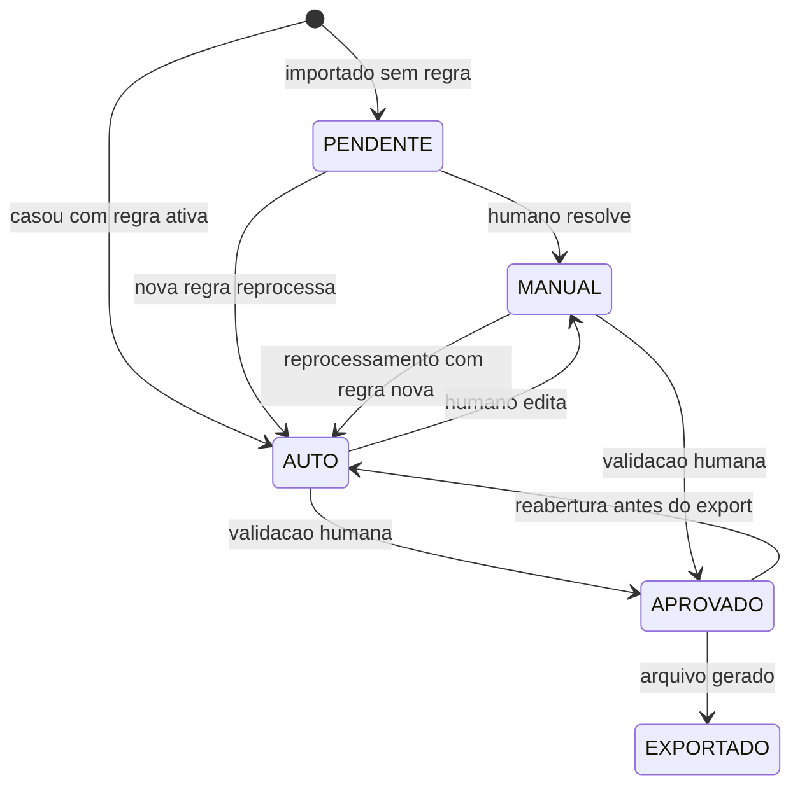

# Requisitos funcionais

> Fase 1 · substitui a seção 1 de [`00-plano-engenharia.md`](../00-plano-engenharia.md), que foi
> escrita antes de os arquivos do cliente serem inspecionados.
> Evidência de cada decisão em [`02-analise-arquivos-cliente.md`](../02-analise-arquivos-cliente.md).

## Objetivo do produto

Transformar os pagamentos de um mês em um arquivo de lançamentos contábeis pronto para importar no
FortesERP, substituindo um processo manual que hoje produz ~440 linhas por mês em planilha.

A jornada, conforme o fluxograma do cliente
([`fluxograma/`](../../fluxograma)):

1. Processar o extrato
2. Cruzar De × Para
3. Obter o histórico
4. Validar e editar
5. Exportar template CSV Fortes

### Confirmações do cliente — 2026-08-24

Registradas na auditoria de alinhamento, sobre os fluxogramas originais:

1. **A tabela de exibição é a planilha Fortes.** Mesmo padrão visual e estrutural
   do Excel de importação (10 colunas, filial `0001`, crédito = banco).
2. **O que for editado na tabela é o que será exportado.** Exceções do contador
   (por exemplo um fornecedor com conta diferente da regra) se resolvem na
   célula, não num arquivo paralelo depois do download.
3. **Hospedagem futura:** `conciliador.projecont.com.br`.

## RF-01 · Importação

| # | Requisito | Prioridade |
|---|---|---|
| RF-01.1 | Importar o relatório Itaú **consulta de pagamentos** (PDF com grade, 7 colunas) | MVP |
| RF-01.2 | Importar o relatório Itaú **extrato de conta corrente** (PDF sem grade, 6 colunas, valores negativos) | MVP |
| RF-01.3 | Importar o **Contas a Pagar - Pagas** do Fortes AG Financeiro (PDF, 59 páginas) | MVP |
| RF-01.4 | Importar o **Plano de Contas** (XLSX) como base de validação | MVP |
| RF-01.5 | Aceitar múltiplos arquivos por competência e uni-los num lote | MVP |
| RF-01.6 | Detectar automaticamente qual dos dois layouts Itaú foi enviado | MVP |
| RF-01.7 | Recusar arquivo cujo período não bate com a competência do lote | MVP |
| RF-01.8 | Detectar reimportação do mesmo arquivo (hash) e avisar antes de duplicar | Desejável |

O sistema **não** importa o extrato bruto como fonte primária de fornecedor: a coluna
`Lançamentos` do extrato traz `SISPAG FORNECEDORES` sem identificar o favorecido. Quando só o
extrato estiver disponível, a `Razão Social` da própria linha é a fonte.

## RF-02 · Motor De/Para

| # | Requisito | Prioridade |
|---|---|---|
| RF-02.1 | Casar o pagamento com uma regra por **documento + nome normalizado** ([ADR 0002](../adr/0002-chave-casamento-cnpj.md)) | MVP |
| RF-02.2 | Aceitar CPF (11 dígitos) e CNPJ (14 dígitos) | MVP |
| RF-02.3 | Casar por nome quando a origem não trouxer documento (concessionárias) | MVP |
| RF-02.4 | Preencher a conta de **crédito** a partir da Base Bancos (conta corrente → conta contábil) | MVP |
| RF-02.5 | Propor o **centro de custo dominante** do fornecedor, editável por lançamento | MVP |
| RF-02.6 | **Nunca** casar parcialmente em silêncio: sem regra clara, o lançamento vira pendência | MVP |
| RF-02.7 | Sinalizar como pendência o fornecedor com mais de uma conta possível | MVP |
| RF-02.8 | CRUD de regras: criar, editar, ativar/desativar, sem apagar histórico de uso | MVP |
| RF-02.9 | Reprocessar o lote ao criar ou alterar regra, atualizando status automaticamente | MVP |
| RF-02.10 | Criar regra **a partir de uma linha pendente**, herdando fornecedor e documento | MVP |
| RF-02.11 | Importar a base inicial minerada ([`base-depara-inicial.csv`](../base-depara-inicial.csv)) | MVP |
| RF-02.12 | Desambiguar por código de despesa do Contas a Pagar | Desejável |

## RF-03 · Derivação do histórico

| # | Requisito | Prioridade |
|---|---|---|
| RF-03.1 | Cruzar pagamento × Contas a Pagar por **valor + fornecedor + proximidade de data** | MVP |
| RF-03.2 | Montar o histórico no padrão `Débito Banc. ref. {tipo doc} {número} - {fornecedor}` | MVP |
| RF-03.3 | **Enriquecer** linhas que o processo manual deixaria como `SISPAG FORNECEDORES` ([ADR 0005](../adr/0005-politica-historico-sispag.md)) | MVP |
| RF-03.4 | Quando não houver título correspondente, usar a descrição bancária e marcar como não derivado | MVP |
| RF-03.5 | Permitir edição manual do histórico na tela de validação | MVP |
| RF-03.6 | Sinalizar título do Contas a Pagar usado por mais de um pagamento | MVP |

## RF-04 · Pendências

| # | Requisito | Prioridade |
|---|---|---|
| RF-04.1 | Listar lançamentos sem conta de débito resolvida | MVP |
| RF-04.2 | Distinguir o motivo: sem regra · regra ambígua · conta inexistente no plano | MVP |
| RF-04.3 | Resolver a linha atribuindo conta, com opção de **salvar como regra** para as próximas | MVP |
| RF-04.4 | Buscar conta contábil por código ou descrição, sobre as 1.516 contas analíticas | MVP |
| RF-04.5 | Aplicar em lote a mesma resolução a todas as linhas do mesmo fornecedor | MVP |
| RF-04.6 | Mostrar quantas linhas serão afetadas antes de confirmar a aplicação em lote | MVP |

## RF-05 · Validação humana

| # | Requisito | Prioridade |
|---|---|---|
| RF-05.1 | Exibir os lançamentos nas colunas do arquivo de destino, no padrão visual da planilha Fortes | MVP |
| RF-05.2 | Toda célula editada na tabela entra no arquivo exportado. Débito, centro de custo e histórico são o mínimo; a grade Fortes é a superfície de exceção | MVP |
| RF-05.3 | Bloquear a aprovação enquanto houver `blocker` aberto | MVP |
| RF-05.4 | Mostrar totais para conferência: nº de lançamentos, soma dos valores, pendências | MVP |
| RF-05.5 | Conferir a soma contra o total do extrato, quando o extrato informar saldo | Desejável |
| RF-05.6 | Registrar quem aprovou e quando | Desejável |

### Validações classificadas

Padrão herdado de [`reference/de-para-folha/journal-builder.js`](../../reference/de-para-folha/journal-builder.js)
([ADR 0004](../adr/0004-reaproveitamento-rayo.md)).

**Blockers** — impedem exportação:

| Código | Condição |
|---|---|
| `CONTA_DEBITO_AUSENTE` | lançamento sem conta de débito |
| `CONTA_INEXISTENTE` | conta não consta no plano (após normalizar dígito verificador) |
| `CONTA_NAO_ANALITICA` | conta é sintética, não aceita lançamento |
| `REGRA_AMBIGUA` | fornecedor com mais de uma conta e sem escolha humana |
| `VALOR_INVALIDO` | valor zero ou negativo após normalização |
| `BANCO_NAO_MAPEADO` | conta corrente de origem sem conta contábil na Base Bancos |

**Warnings** — permitem exportação com ciência:

| Código | Condição |
|---|---|
| `HISTORICO_NAO_DERIVADO` | sem título correspondente no Contas a Pagar |
| `CENTRO_CUSTO_SUGERIDO` | fornecedor tem mais de um centro observado |
| `REGRA_CONFIANCA_MEDIA` | regra minerada com base em 1–2 meses |
| `FORNECEDOR_SEM_DOCUMENTO` | casamento feito só por nome |
| `TITULO_REUTILIZADO` | mesmo título do Contas a Pagar usado por outro pagamento |
| `DIVERGENCIA_TOTAL` | soma dos lançamentos difere do total do extrato |

## RF-06 · Exportação

| # | Requisito | Prioridade |
|---|---|---|
| RF-06.1 | Gerar arquivo nas 11 colunas confirmadas, na ordem e formato do modelo | MVP |
| RF-06.2 | Liberar a exportação somente após aprovação humana | MVP |
| RF-06.3 | Gerar planilha de conferência antes do arquivo final | MVP |
| RF-06.4 | Registrar o lote como `EXPORTADO` e impedir reexportação silenciosa | MVP |
| RF-06.5 | Exportar as pendências não resolvidas em arquivo separado | Desejável |

## Ciclo de vida

Espelha o padrão `draft → blocked → ready → approved → exported` de
[`folha-dealer-data-contracts.md`](../referencia/folha-dealer-data-contracts.md).

### Estado do lançamento

### Estado do lote

`RASCUNHO` → `BLOQUEADO` (tem blocker) → `PRONTO` (só warnings) → `APROVADO` → `EXPORTADO`

A transição para `APROVADO` só existe a partir de `PRONTO`. É o que implementa RF-05.3 e RF-06.2.

## Fora de escopo no MVP

Registrado para que ninguém reintroduza por conta própria:

- **Matching Doc ↔ Nº Origem** e **netting** de [`reference/banco-razao/`](../../reference/banco-razao).
  Outro caso de uso, e o netting tem bug documentado ([ADR 0004](../adr/0004-reaproveitamento-rayo.md)).
- **Conciliação extrato × razão contábil.** Este produto gera lançamento, não confere lançamento
  existente.
- **Lançamentos de crédito** (recebimentos). Todos os 2.487 registros históricos são pagamentos,
  com o banco sempre no crédito.
- **Contas correntes além do Itaú.** A Base Bancos suporta as 5 contas do plano, mas só o Itaú
  `1.01.01.02.01.0003` aparece no histórico. Pergunta aberta ao cliente.
- **Multi-filial.** A coluna A é `0001` (Matriz) em 100% das linhas.
- **Multiempresa / autenticação.** Uma empresa, uso interno do contador.
